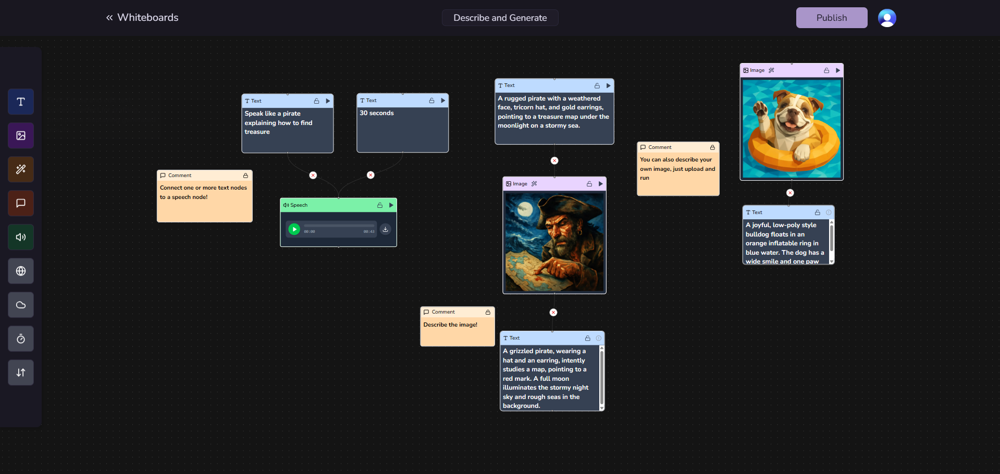
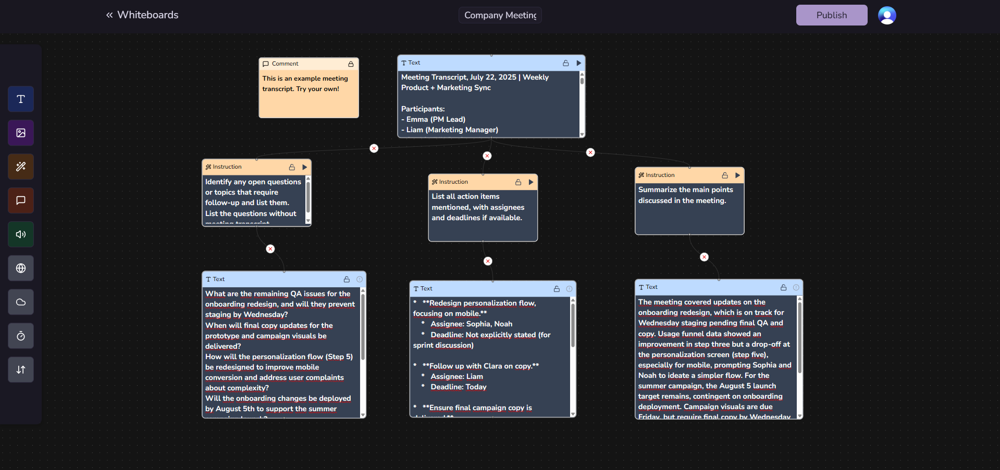

# Canvas Flow Studio

[]

Canvas Flow Studio is a website which allows users to create whiteboards. It has a nice drag & drop UI. Users can use nodes and connect them to generate an AI workflow.

> Please check out the docs at [https://ai-flow-studio-v2.vercel.app/docs](https://ai-flow-studio-v2.vercel.app/docs)

## Example whiteboards

> These examples are pulled from templates section on the home page

### Describe and Generate

Describe images, generate speech and image.

### Company Meeting

Corporate life was never easier 😂. Checkmate.

